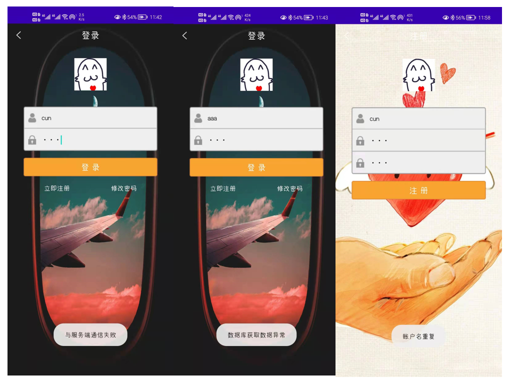

# Android音乐播放器

### 使用前必看

**关于程序该如何使用的问题，请一定要查看我写的博客**(地址：https://blog.csdn.net/cun_king/article/details/117847607 )   涉及开发环境、Maven、Tomcat、MySQL等内容，手把手演示。对你有帮助的话希望留下一个赞，谢谢。

**关于源代码讲解，请查看我的专栏**（地址：https://blog.csdn.net/cun_king/category_11150848.html ）

有什么问题都可以留言，或者联系我的邮箱sjcup97@163.com

如果对你有帮助的话，非常欢迎点个“star”

另外，这个只适合用于做一个大学课设，目前程序还有很多不合理的地方，暂没有精力修改。

如果恰好手头宽裕的话，去我博客下面打赏一杯奶茶也不是不可以（😄）

### 2021.12.19更新

新设计了一个简易的后台管理，这个管理程序有后台数据的增删查改功能，由c#程序所写，使用前需要先在管理程序中bin\Debug目录下找到Manage.ini文件，用记事本打开。修改数据库连接串，也就是使用自己电脑上MySQL的账户和密码。最后还是在这个文件夹内，找到exe文件，打开即可使用。

### 2022.1.1 更新（相关博文会尽快更新）

为程序添加了注释，改动了部分程序。

**服务端：**

- 添加了自定义异常类，可以根据自己需求抛出特定的异常
- 添加了slf4j+log4j的日志框架，可以记录相关信息。文本路径在tomcat的bin目录下，名称为：musicplayer.log   当出现问题时可以根据日志文件调试（程序如果出现bug，也可以将日志提交给我，我来进行修改）

**安卓端：**

- 密码使用md5加密再进行传输，密码不再使用明文传输
- 细化了消息提醒。连接不上服务端会提示“与服务端通信失败”；数据库连接失败会提示“数据库获取数据异常”；注册时不允许账户名重复，如果重复会提醒。调试可以根据相关提示进行调试。

### 针对一些同学

很多同学拿来做课设，但是又对于一些同学，比如不了解maven、Tomcat、MySQL、Android等配置的同学搭建环境太难了，现针对这些同学，我可以以有偿的方式**帮助你远程在你的电脑上搭建环境**，**直至完整运行**，感兴趣地可以联系我的邮箱sjcup97@163.com。

